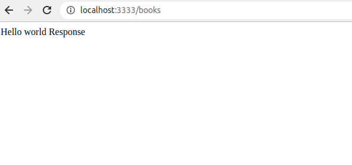

# kubernetes_bootcamp

## Before you start

First thing you will need for this workshop is a running rest api on a headless platform. like node, java, dotnetcore, go, python etc..

For this example ill be using a node rest api, but you can use whatever you like as mentioned above.

### Install what you need to run node. or whatever microservice you decide
* install node
* install npm
* check by running
```
node --version
npm --version
```

### Install docker
(https://docs.docker.com/engine/install/)
* check by running 
```
docker ps
```

### Install kubectl
(https://kubernetes.io/docs/tasks/tools/)
* check by running
```
kubectl version
```

## Build and run your app
If you're running the app ive built, then you just need to build it
```
npm install
node index.js
```
opening a browser and going to http://localhost:3333/books should show

