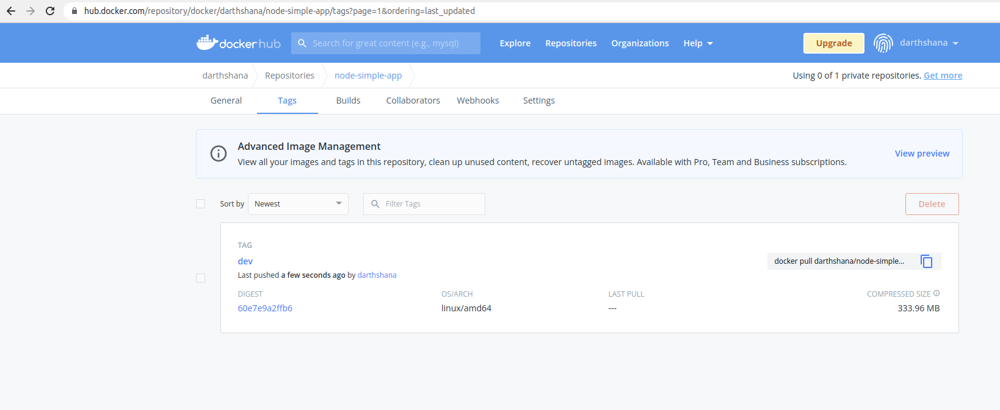

# kubernetes_bootcamp

## Before you start

First thing you will need for this workshop is a running rest api on a headless platform. like node, java, dotnetcore, go, python etc..

For this example ill be using a node rest api, but you can use whatever you like as mentioned above.

### Install what you need to run node. or whatever microservice you decide
* install node
* install npm
* check by running
```
node --version
npm --version
```

### Install docker
(https://docs.docker.com/engine/install/)
* check by running 
```
docker ps
```

### Create an account on DockerHUB
There are a lot of different docker containers you could use in this tutorial ill be using a free and public dockerHub 
account. You can create one at (https://hub.docker.com/). Check that you can do 
```
docker login
```

### Install kubectl
(https://kubernetes.io/docs/tasks/tools/)
* check by running
```
kubectl version
```

## Build and run your app
### Build and run
If you're running the app ive built, then you just need to build it
```
npm install
node index.js
```
opening a browser and going to http://localhost:3333/books should show


### Build your docker image
```
docker build . -t [DOCKERHUB_USERNAME]/node-simple-app:dev
```
### Test your image
```
docker run -p 8080:3333 darthshana/node-simple-app:dev
```
Now going to http://localhost:8080/books should give you the same result as the figure above
### Push your image to the world
```
docker push [DOCKERHUB_USERNAME]/node-simple-app:dev
```
now check that your image is available for the whole world to use. But only you can push to it.

